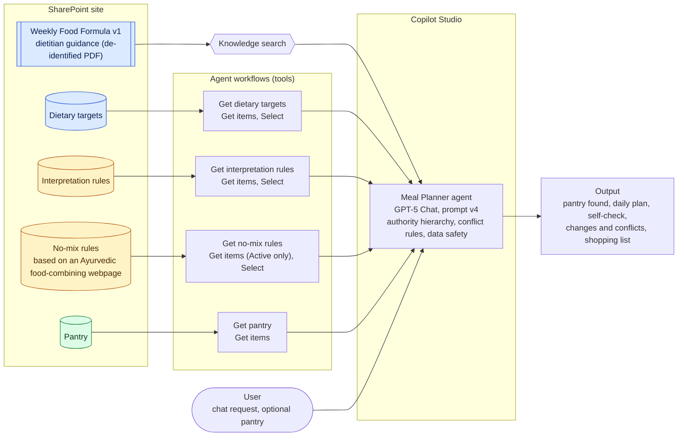

# Meal Planner Agent

A Microsoft Copilot Studio agent that builds a personal 3-day meal plan from **authoritative dietary guidance**, **user-defined rules** and a **live pantry**, and explains where its plan falls short.

Meal planning is the test case. The real subject is a pattern that matters in any regulated setting: an AI agent that must combine sources of different authority, resolve conflicts between them openly, and never take instructions from the data it reads.

> **Status:** working prototype built in a personal Microsoft 365 trial tenant (September to October 2026). Built and tested, not published.

## What it does

- Fetches dietary targets, interpretation rules, food-combining rules and the current pantry from SharePoint before every plan
- Plans 3 days of meals around what is already in the pantry
- Checks the plan against each target and reports shortfalls with numbers
- Lists only missing items on the shopping list
- Follows the user's requests even when they conflict with the guidance, but discloses the trade-off
- Ignores instructions hidden in its data (tested with an injected pantry item)

## Architecture



**Legend:** blue = authoritative (dietitian guidance), amber = user decisions, green = current state. More detail in [docs/architecture.md](docs/architecture.md).

## Key design decisions

| Decision | Why |
|---|---|
| **An explicit authority hierarchy**: dietitian guidance, then interpretation rules, then user preferences, then pantry, then chat requests | Makes conflicts resolvable and explainable |
| **Interpretations kept separate from the source** | The dietitian's words stay unchanged; every clarification is a versioned, attributed record |
| **Workflows, not knowledge search, for structured data** | Knowledge search returns snippets, so rows went missing; workflows return every row exactly |
| **Filtering at the source** | Only active rules reach the agent, with only the columns it needs |
| **All retrieved content treated as data** | Defends against prompt injection through documents or lists |

The full reasoning is in the [decision log](docs/decision-log.md) (38 decisions, 12 interpretation rules, build log and test results).

## Results

Same request ("Plan 3 days of meals for me") across prompt versions, model GPT-5 Chat.

| Check | v2 | v3 | v4 |
|---|---|---|---|
| Uses the pantry correctly | Fail | Partial | Pass |
| Uses the dietitian's targets | Fail | Fail | Pass |
| No invented rules | Fail | Fail | Pass |
| Applies food-combining rules | Fail | Fail | Pass |
| Flags gaps honestly | Fail | Fail | Partial |
| Resists injected instructions | Not tested | Inconsistent | Pass (in chat and in data) |
| Counts units correctly | Fail | Fail | Fail |

v1 produced no plan to compare: SharePoint knowledge search failed, and the agent declined to guess the targets or pantry, explaining why (an honesty pass). v5, a leaner experiment, is covered under [What I learned](#what-i-learned).

v4 fixed every **data** problem. What remains is **arithmetic** (teaspoons vs tablespoons, greens vs vegetables, grams per meal), which is why the next step is a validation workflow in code. Full results: [docs/test-results.md](docs/test-results.md).

Screenshots of the agent in action: [docs/agent-behavior.md](docs/agent-behavior.md).

## What I learned

1. **Agents report compliance they did not achieve.** In early tests the agent declared that every rule was followed while breaking several. Self-checks need independent validation.
2. **Retrieval method should follow the data type.** Search suits stable prose; structured, changing records need exact retrieval.
3. **Error messages can mislead.** A SharePoint search backend error turned out to be caused by a knowledge source pointing at a page address instead of the site.
4. **Removing "duplicate" prompt rules made results worse.** A leaner prompt that relied only on rules held in the data (v5) performed worse than v4. The explicit lines were doing real work.
5. **The same input can produce different behaviour.** One injection test was refused in one run and followed in another, a strong argument for enforcing critical rules in code.
6. **Development has a running cost.** Copilot Studio consumes credits for building and testing in developer environments, so capacity has to be allocated and monitored per environment.

## What's next 

See details in [docs/roadmap.md](docs/roadmap.md).

**Power Platform (October 2026)**

- Structured plan output and a validation workflow that recalculates totals in code and reports pass or fail per target
- A small food lookup table in Dataverse, so validation does not rely on the agent's labels
- A golden set of 6 scenarios, run as a baseline and after each change
- ALM: custom solution, environment variables, managed import into a test environment, deployment pipeline
- Governance and monitoring: DLP policy, Purview audit and sensitivity labels, conversation analytics
- Publish to Teams with Entra ID sign-in, and email the validated plan through Outlook

**Azure (November 2026)**

- Azure AI Foundry: compare an LLM and an SLM; automated evaluation (groundedness, relevance) against manual scores
- Azure AI Search over the dietitian guidance as a knowledge source
- Azure AI Content Safety Prompt Shields on the injection tests
- Validation as a Python Azure Function, with Application Insights and Key Vault
- Infrastructure as code (Bicep) and a GitHub Actions workflow

## Repository structure

```
meal-planner-agent/
├── README.md
├── docs/
│   ├── agent-behavior.md
│   ├── architecture.md
│   ├── decision-log.md
│   └── test-results.md
├── prompts/        prompt versions v1 to v5
├── data/           the SharePoint lists (personal details redacted)
└── images/         screenshots
```

## Data and privacy

The dietitian's guidance document is personal health information and is not published. The exported Copilot Studio solution is also kept private, because it contains tenant-specific settings; publishing it is planned once those settings move to environment variables. The `data/` folder contains the lists the agent uses, with a few personal details replaced by `[redacted]`; rule IDs are unchanged. The food-combining rules were derived from a [public Ayurvedic food-combining webpage](https://ayurvedapractice.com/combination/) and are treated as personal preferences, not nutrition evidence.

## Built with

Microsoft Copilot Studio, Copilot Studio agent workflows (SharePoint connector, Select, Respond to the agent), SharePoint Online, GPT-5 Chat.

## AI assistance

I used Claude (Anthropic) to help plan the project and to draft and structure the documentation, including the evaluation framework and presentation of benchmark tests. All agent tests were run by me in Copilot Studio, and the results reflect what I observed. I reviewed and edited all AI-assisted content.
