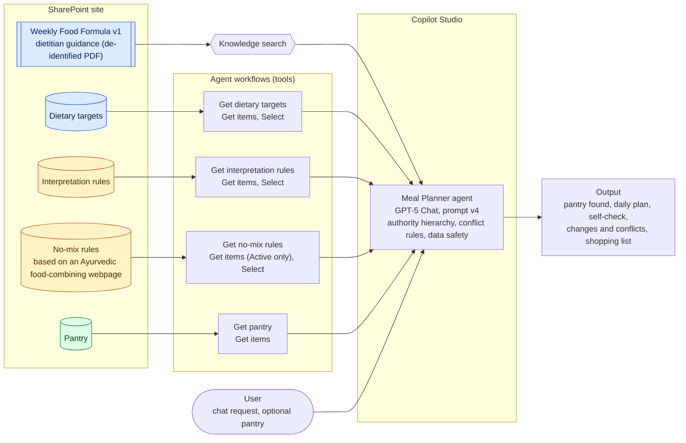

# Meal Planner Agent: Architecture

A Microsoft Copilot Studio agent that plans meals from authoritative dietary guidance, user-defined rules and live pantry data. Structured data is fetched exactly through workflows; only the guidance document goes through knowledge search.

**Legend:** blue = authoritative (dietitian guidance), amber = user decisions (interpretation and no-mix rules), green = current state (pantry).

## Layers

| Layer | What it does |
|---|---|
| **Sources** | SharePoint holds one document and four lists. The lists are the single source of truth; each record carries its source, version and author. |
| **Retrieval** | The guidance PDF is read through knowledge search, which suits stable prose. Each list is read by its own workflow, which returns every row exactly and only the columns the agent needs. |
| **Agent** | Copilot Studio agent (GPT-5 Chat). The prompt sets the authority hierarchy, how to handle conflicts, and treats all retrieved content as data, never instructions. |
| **Output** | A 3-day plan with a self-check against each target, the rules that changed the plan, and a shopping list of items not in the pantry. |

## Authority hierarchy

1. **Dietitian guidance and targets**: authoritative.
2. **Interpretation rules**: the user's clarifications where the guidance is ambiguous.
3. **No-mix rules and exclusions**: user preferences, based on an [Ayurvedic food-combining webpage](https://ayurvedapractice.com/combination/); can conflict with guidance, and the agent discloses any shortfall.
4. **Pantry**: current state, read live; a pantry given in chat replaces it for that plan.
5. **Chat requests**: preferences for the current plan.

## Why workflows instead of knowledge search for the lists

Testing showed knowledge search returns snippets rather than whole records. The agent missed the last pantry rows, read only the dormant no-mix rules at the top of the file and concluded no rules applied, and presented the guidance's shopping advice as the user's pantry. Workflows fixed all three: every row arrives exactly, and filtering happens at the source (for example, only active no-mix rules are sent).

## Workflow details

Each workflow follows the same pattern: **When an agent calls the flow**, then **Get items** (SharePoint connector, site MealPlannerAgent), then **Select**, then **Respond to the agent**. Select uses `@body('Get_items')?['value']` as **From**, and each workflow returns one Text output.

| Workflow | What it does | Get items | Select (key: value) | Respond to the agent |
|---|---|---|---|---|
| **Get dietary targets** | Returns the dietitian's targets for each food group: the range, unit, period and serving size. These are the numbers the plan is checked against. | List: Dietary targets | Food group: `@item()?['Title']` Target: `@item()?['field_1']` Min: `@item()?['field_2']` Max: `@item()?['field_3']` Unit: `@item()?['field_4']` Period: `@item()?['field_5']` Serving: `@item()?['field_6']` | `@string(body('Select'))` |
| **Get interpretation rules** | Returns the user's clarifications where the guidance is vague, for example "a few times a week" means at least 4. | List: Interpretation rules | Rule: `@item()?['Title']` Applies to: `@item()?['field_1']` Source: `@item()?['field_2']` Interpretation: `@item()?['field_3']` | `@string(body('Select'))` |
| **Get no-mix rules** | Returns only the active food-combining rules, as pairs of foods not to mix in the same meal. | List: No-mix rules Filter Query: `field_12 eq 'Active'` | Rule: `@item()?['Title']` Type: `@item()?['field_1']` Food A: `@item()?['field_2']` Food B: `@item()?['field_3']` Instruction: `@item()?['field_4']` | `@string(body('Select'))` |
| **Get pantry** | Returns what is in the pantry now, with quantities, so the plan uses it first and the shopping list leaves it out. | List: Pantry | None (all columns, including the last-updated date) | The Get items `value` |

Notes on the design:

- **SharePoint internal names.** Imported lists store columns as `field_1`, `field_2` and so on, so the Select maps them back to readable keys for the agent.
- **Fewer columns, fewer errors.** The interpretation rules' min and max columns are left out because blank cells arrive as 0, which the agent could read literally. The numbers already appear in the interpretation text.
- **Filtering at the source.** Sending all 36 no-mix rules with SharePoint metadata was too large, and the agent read only the first 14. The filter and Select reduce it to the 23 active rules and five columns.
- **A designer quirk.** Picking fields from the dynamic content list wrapped Select in an Apply to each loop. Typing From and every map value as `@` expressions avoided it.

